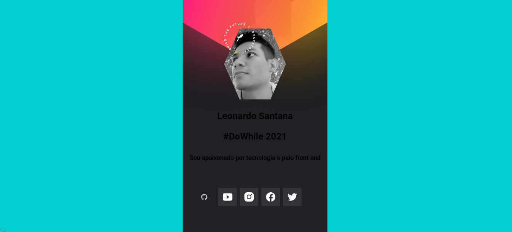

Card desenvolvido durante o segundo dia da NLW Heat da Rocketseat na trilha Origin. Nessa aula, foi aprendido vários conceitos e técnicas principalmente do CSS para alinhar corretamente o card. 

Tecnologias usadas: HTML5 e CSS3.

